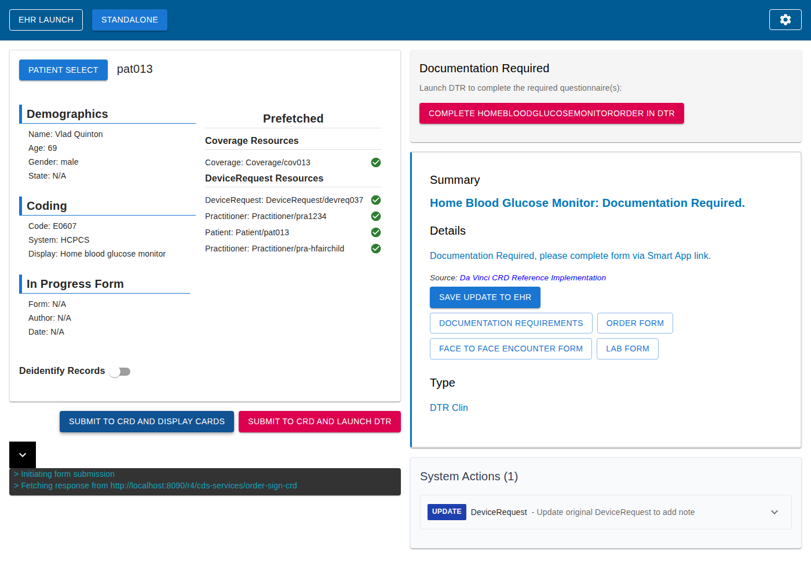
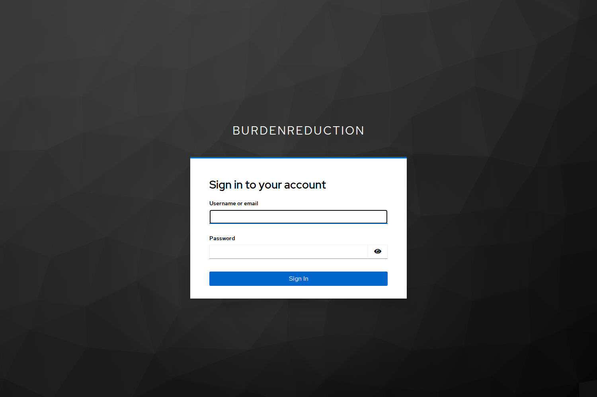
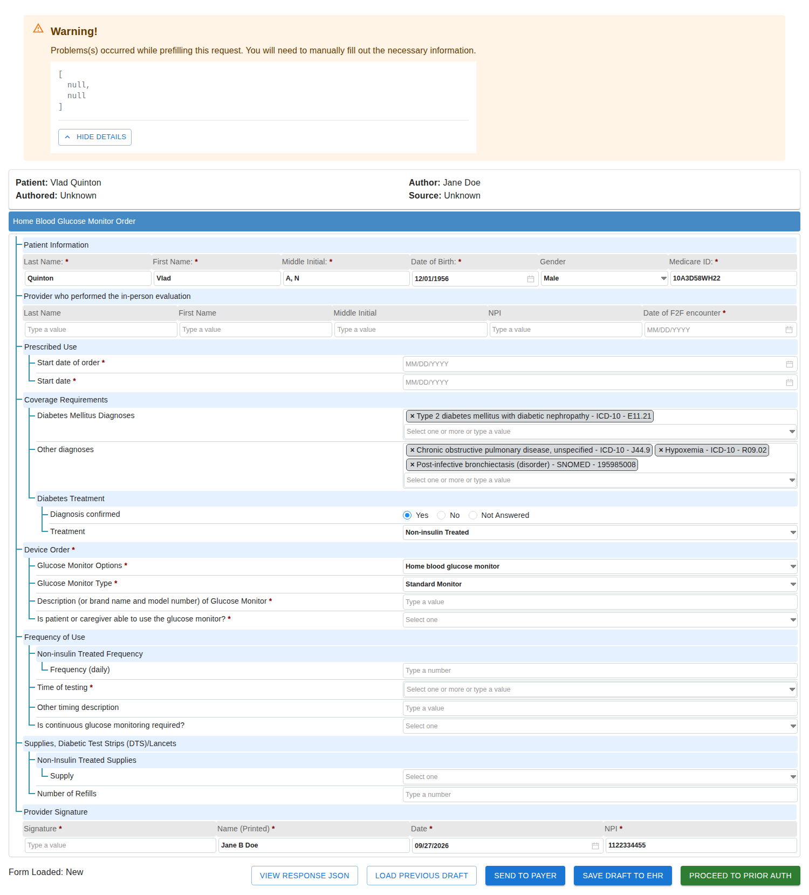

# DaVinci Prior Auth — Local Mock Stack

A **locally-runnable mock of the HL7 DaVinci prior authorization flow** — CRD → DTR → PAS —
with **no container runtime**. Six upstream DaVinci services run as ordinary background
processes, and the whole chain is verified end to end in a real browser: coverage card →
SMART launch → Keycloak login → questionnaire → a `Claim` that DTR builds for itself →
PAS `201` → `Pending` → `Granted`.

The structure is deliberate: the fake pieces sit in `bin/`, the real ones are pinned
upstream checkouts. When the mocks need retiring, the real service drops into the same
slot.

**Run version: `versions.lock` as of this commit** — `bin/demo.sh` 12/12, `bin/e2e-browser.py`
14/14, all six services up. `versions.lock` is the authoritative pin set; see
[Pin discipline](#pin-discipline).



> **All patient data in this repository is synthetic.** It comes from upstream's own test
> fixtures — the familiar `Tables, Bobby` / `Quinton, Vlad` set, with invented MRNs and birth
> dates. There is no real patient and no real PHI anywhere in this tree, including in the
> screenshots. Please keep it that way.

---

## Quick start

Requires **Ubuntu 24.04 LTS**, **Node 22**, and a system **JDK 21** for Keycloak. Allow
~3 GB of disk and 7 GB of RAM. First start takes 20–40 minutes; every run after that is
about one.

```bash
# 0. system prerequisites
sudo apt-get install -y openjdk-21-jdk-headless git curl iproute2 python3 unzip
# Node 22 from nvm/fnm/asdf — see Requirements. provision.sh asserts the major and
# prints what it found, so a wrong one fails immediately rather than as opaque ESM errors.

# 0b. REQUIRED unless you are root: three paths default to /opt and /root, which a
#     normal user cannot write. Skip this and provisioning dies with a bare
#     "Permission denied" on the Keycloak step, then again on the Gradle cache.
if [ "$(id -u)" -ne 0 ]; then
  export KEYCLOAK_HOME="$HOME/.local/keycloak"
  export GRADLE_USER_HOME="$HOME/.cache/gradle"
  export VSAC_CACHE_DIR="$HOME/.cache/vsac"
fi

# 1. get the code
git clone https://github.com/Abaabeel/davinci-mock.git
cd davinci-mock

# 2. provision the pinned inputs (6 upstream repos, JDK 17, Maven, Keycloak)
./bin/provision.sh
./bin/provision.sh --check        # must report "all inputs present"

# 3. start the six services
./bin/up.sh                       # first run also builds the two frontends
./bin/down.sh --purge && ./bin/up.sh --reset    # ...or force a clean cold start

# 4. drive it
./bin/demo.sh                              # 12 assertions, API only  -> 12/12

# 4b. the browser driver needs Playwright, which the stack itself does not:
pip install playwright && playwright install chromium --with-deps
python3 bin/e2e-browser.py                # 14 assertions, real browser -> 14/14
```

Then open **<http://localhost:3001/>** and follow
[the browser walkthrough](#walkthrough-the-browser-path), or just read what the drivers
prove.

To stop: `./bin/down.sh` (add `--purge` to drop PAS/DTR state as well).

---

## Do I need any credentials?

**No.** Not one. There is nothing to sign up for, no API key to request, no account, no
paid service, no `.env` file to fill in. Clone, run the four commands above, done.

Everything the stack authenticates against is either a public upstream repository or a
throwaway value that ships in this repo. Here is the complete list, so you can confirm that
for yourself rather than take it on trust:

| What | Value | Where it comes from | Do I need to do anything? |
|---|---|---|---|
| Keycloak admin | `admin` / `admin` | default in `bin/env.sh`; used once at boot to import the realm | No. Override with `KEYCLOAK_ADMIN_USER` / `KEYCLOAK_ADMIN_PASS` if you care |
| Keycloak demo user | `dtr` / `dtr-demo` | `fixtures/keycloak/BurdenReduction-realm.json`, the realm `bin/up.sh` imports | No. `e2e-browser.py` types it for you |
| Keycloak client secret | `#replaceMe#` | the same fixture — a literal upstream placeholder, not a real secret | No. Nothing in the stack authenticates to Keycloak at all (see below) |
| PAS FHIR client | none | PAS runs with `BYPASS_AUTH=true` and issues its own token from its own H2 database | No |
| GitHub (to clone) | none | the repository is public — anonymous `git clone` just works | No |
| VSAC API key | absent | optional. Without it, 67 value sets do not resolve, so value-set-gated CDS rules cannot fire. Everything else, including the browser path, works | No. Uncomment `VSAC_API_KEY` in `bin/env.sh` only if you want those rules |

**Why the stack needs no credentials at all:** the two services that *could* require them
have been deliberately configured not to. PAS runs with `BYPASS_AUTH=true` and keeps its own
client table in an H2 database. CRD runs with `use_oauth: false` and `checkJwt: false`, so it
never asks Keycloak to validate a token. Keycloak is in the stack for one reason only: the
DTR launch does a real SMART/OIDC redirect through a login page, so the browser path is
genuinely end-to-end rather than stubbed. The realm it serves is a local demo realm with the
throwaway credentials above.

The only genuinely external things the stack fetches are the six **public** upstream DaVinci
repositories and their Maven/npm dependencies, all pinned to exact SHAs in `versions.lock`.

> If a script ever stops you asking for something that is not in that table, treat it as a
> bug in the script rather than something you are missing.

Two notes on the drivers:

- `bin/demo.sh` needs nothing beyond `python3` and `curl`.
- `bin/e2e-browser.py` is the only thing that needs **Playwright + Chromium**:
  `pip install playwright && playwright install chromium --with-deps`. If Playwright is
  missing the script says so and exits, rather than failing obscurely. The stack itself
  runs fine without it — it is only the browser test that needs a browser.

---

## For AI agents

`AGENTS.md` in the repository root is a self-contained playbook: point an agent at it and it
can provision the stack, start it, verify it, and report the result without reading anything
else or asking any questions. It also lists the traps that produce convincing but wrong
results, so an agent does not spend a cycle rediscovering them.

---

## Contents

- [Quick start](#quick-start)
- [Do I need any credentials?](#do-i-need-any-credentials)
- [For AI agents](#for-ai-agents)
- [What it does](#what-it-does)
- [The six services](#the-six-services)
- [Requirements](#requirements)
- [Install](#install)
- [Run](#run)
- [Walkthrough: the browser path](#walkthrough-the-browser-path)
- [Walkthrough: the API path](#walkthrough-the-api-path)
- [Stop and reset](#stop-and-reset)
- [Reaching it from another machine](#reaching-it-from-another-machine)
- [What is *not* in this repository](#what-is-not-in-this-repository)
- [Repository layout](#repository-layout)
- [Pinned versions](#pinned-versions)
- [Troubleshooting](#troubleshooting)
- [Known issues](#known-issues)
- [Security note](#security-note)
- [Licence](#licence)
- [Further reading](#further-reading)

---

## What it does

The DaVinci prior-auth flow, as this stack runs it:

```
  crg  :3001            CRD  :8090         test-ehr :8080        Keycloak :8180
  mock EHR UI    ──▶    coverage rules  ──▶  mock FHIR R4    ──▶   realm BurdenReduction
      │                       │                    │                        │
      │  "Documentation      │  card names the    │  SMART launch,         │  dtr / dtr-demo
      │   Required"          │  questionnaire     │  OAuth proxy           │
      ▼                       ▼                    ▼                        ▼
  dtr :3005  ──▶  fill the questionnaire  ──▶  dtr builds a Claim  ──▶  Submit
                                                                            │
                                                                            ▼
                                                          PAS :9015  Claim/$submit 201
                                                          PENDING  ──(15 s DELAY)──▶  GRANTED
```

Two flows, and they are **not** redundant:

| Driver | Type | Asserts | What it covers |
|---|---|---|---|
| `bin/demo.sh` | API, no browser | 12 | card → questionnaire canonical → SMART `launch_id` → `Claim/$submit` 201 → `PENDING` → `GRANTED` |
| `bin/e2e-browser.py` | real browser (Playwright) | 14 | all of the above **plus** the Keycloak login and the `Claim` that **DTR builds itself** |

The load-bearing fact, and the reason the second driver exists: **`dtr`, not the EHR,
submits the claim.** Clicking `PROCEED TO PRIOR AUTH` builds a `Claim` from the
QuestionnaireResponse, and the panel it swaps in has the only button in the entire stack
that POSTs `Claim/$submit` from a browser. Nothing in crg or test-ehr references PAS at
all — so `demo.sh`, which posts the Claim itself, can never cover that leg, and
grepping the EHR repos for it finds nothing.

## The six services

| Service | Port | Stack | What it does here |
|---|---|---|---|
| `test-ehr` | 8080 | Java / HAPI FHIR JPA server, Maven | mock FHIR 4.0.1 R4 server + the OAuth proxy that fronts Keycloak. R4 base: `http://localhost:8080/test-ehr/r4` |
| `crd` | 8090 | Java / Quarkus, Gradle | CDS Hooks server + coverage rules. The `order-sign-crd` hook returns the "Documentation Required" card. **Not a FHIR server** — `/metadata` is a 404 |
| `prior-auth` (PAS) | 9015 | Java / Spring Boot 2.7, Gradle | prior auth; H2 on disk. `POST /fhir/Claim/$submit` → 201; CQL rules decide `Pending` → `Granted` on a 15 s timer |
| `keycloak` | 8180 | Keycloak 26.7.4 (Quarkus) | realm `BurdenReduction`, public client `app-login`, user `dtr` / `dtr-demo`. Required by the DTR hop |
| `dtr` | 3005 | Node 22 / React 19 / Express 5 | SMART app: login, questionnaire, **and builds + submits the Claim** |
| `crd-request-generator` (crg) | 3001 | Node 22 / React | the mock EHR UI you drive the demo from |

Deliberately **six independent process groups**, not one supervisor: a crash in one must
not kill-loop the rest, and each needs its own readiness signal. Each service gets its own
log (`logs/<svc>.log`) and PID file (`pids/<svc>.pid`).

> **Port 3000 is not used.** An unrelated Next.js app owns it on this host and
> `bin/down.sh` is written to leave it alone. crg runs on **3001**.

Three upstream services from `prior-auth/docker-compose.yml` are intentionally excluded:
`prior-auth-client` (9090, redundant), `fhir-x12` (8085) and `fhir-x12-frontend` (3015).

## Requirements

| Need | Version | Notes |
|---|---|---|
| **Ubuntu** | 24.04 LTS (or a close relative — Debian 12, Fedora 40+) | any modern glibc Linux. Windows and macOS are not supported |
| `bash`, `git`, `curl`, `ss` (iproute2), `python3`, `unzip` | — | all used by `bin/` |
| **Node.js** | major **22** | asserted by `provision.sh`; runs dtr + crg. Neither upstream `package.json` declares `engines`, so the wrong major fails as opaque ESM errors |
| **JDK 21** | 21 | **Keycloak only** — `kc.sh` runs `$JAVA_HOME/bin/java`. `sudo apt-get install -y openjdk-21-jdk-headless` |
| **Disk** | ~3 GB for `repos/` + `runtime/`, plus headroom | `repos/` ≈ 1.2 GB, `runtime/` ≈ 337 MB, Keycloak ≈ 190 MB, plus npm/Gradle caches |
| **RAM** | 7 GB total is the working minimum | per-JVM heap caps are set in `bin/env.sh`; see the table below |
| **Root** | not required, but you must redirect three paths | as root, nothing to do. Otherwise set `KEYCLOAK_HOME`, `GRADLE_USER_HOME` and `VSAC_CACHE_DIR` — see [Step 1b](#step-1b-not-running-as-root-redirect-three-paths) |

**The JDK for CRD, PAS and test-ehr is provisioned for you** — Temurin
`17.0.20.1+1` unpacked to `runtime/jdk17`, checksum-verified, nothing installed
system-wide. You do not need a system JDK 17.

Three paths are the exception, because they are deliberately kept *off* the project folder
(the checkout may be on a slow or small filesystem — see
[First run is slow](#first-run-is-slow-and-that-is-the-filesystem)):

| Variable | Default | Why it is outside |
|---|---|---|
| `KEYCLOAK_HOME` | `/opt/keycloak` | 190 MB unpacked; would be wiped by `bin/clone.sh` |
| `GRADLE_USER_HOME` | `/root/.cache/davinci-mock/gradle` | tens of thousands of small files |
| `VSAC_CACHE_DIR` | `/root/.cache/davinci-mock/vsac-cache` | 1.5 MB of terminology, wiped by `bin/clone.sh` |

**As root, all three work as-is. As anyone else, override all three or provisioning fails**
with a bare `Permission denied`. The trailing slash on `VSAC_CACHE_DIR` is load-bearing but
`bin/env.sh` adds it for you — do not strip it from the value you pass.

### Reference system

The most recent certified run was green on exactly this:

| | |
|---|---|
| **OS** | Ubuntu 24.04.5 LTS (Noble Numbat) |
| **Architecture** | x86_64 / `amd64` |
| **glibc** | 2.39 |
| **CPU** | 12 vCPU |
| **RAM** | 7 GB total |
| **Shell** | bash 5.2, zsh 5.9 |

Everything below that is provisioned, verified by `bin/provision.sh --check`:

| | |
|---|---|
| **JDK (CRD / PAS / test-ehr)** | Temurin `17.0.20.1+1` → `runtime/jdk17` |
| **JDK (Keycloak only)** | OpenJDK `21.0.12` at `/usr/lib/jvm/java-21-openjdk-amd64` |
| **Maven** | `3.9.9` → `runtime/maven` |
| **Node / npm** | `v22.23.1` / `10.9.8` (requirement — install with nvm/fnm/asdf) |
| **Python** | `3.12.3` (only for `e2e-browser.py` and the ad-hoc probes) |
| **Keycloak** | `26.7.4` → `$KEYCLOAK_HOME`, default `/opt/keycloak` — **root-only default**, override if not root |
| **Playwright** | `1.58.0` + bundled Chromium (only for `e2e-browser.py`) |

System `git` 2.43.0 and `curl` 8.5.0 from the distro are sufficient.

Heap caps (upstream's own 8 GB minimum is not reachable here, so these are mandatory):

| Service | `-Xmx` | Service | `-Xmx` |
|---|---|---|---|
| PAS | 768m | dtr (runtime) | 256 MB |
| CRD | 640m | crg | 256 MB |
| test-ehr | 512m | dtr (**webpack build**) | 1280 MB — core-dumps at the runtime cap |

**Never export a global `PORT`.** `bin/up.sh` passes it per service. A global
`PORT=3001` intended for crg silently drags dtr onto 3001 (dtr's `bin/www` reads
`PORT` *before* `REACT_APP_SERVER_PORT`), crg then dies `EADDRINUSE`, and the stack still
probes green.

### First run is slow, and that is the filesystem

Every timing below is a **floor**, not a typical value:

| Step | Time |
|---|---|
| `provision.sh` (6 clones + JDK + Maven + Keycloak) | 5–15 min |
| First `up.sh --reset` (npm install + webpack build for dtr and crg) | 20–40 min |
| Subsequent `up.sh --reset` (warm) | 5–6 min |

The original development host kept the checkout on a virtualised Windows **9p/DrvFs**
mount, which measured **~260× slower than ext4** for small-file writes (2000 files: 9.85 s
vs 0.04 s) with only ~11 GB free — that is where the numbers above come from, and a plain
ext4 Ubuntu disk will be materially faster. Two consequences are already handled regardless
of where you clone it: the Gradle and Maven caches are redirected off the project folder
(`GRADLE_USER_HOME`, `~/.m2`), and the VSAC cache and Keycloak are deliberately kept off
it too. Move all three onto fast local disk and the cold start drops sharply.

**Clone onto a normal ext4 filesystem.** `/tmp` is never used for anything in this project
— it was wiped once already, taking the whole toolchain with it. Downloads land in
`runtime/downloads/`.

## Install

```bash
git clone https://github.com/Abaabeel/davinci-mock.git
cd davinci-mock
```

This repo is the **orchestration, not the payload.** 1.2 GB of upstream clones and a
337 MB toolchain are excluded from git on purpose and re-created from `versions.lock`.

### Step 1 — system packages

```bash
sudo apt-get install -y openjdk-21-jdk-headless   # Keycloak only; the stack itself runs on 17
# plus: git, curl, iproute2 (ss), python3, unzip
```

Node 22 comes from your version manager (nvm, fnm, asdf) — `provision.sh` asserts the
major version and prints what it found.

### Step 1b — not running as root? Redirect three paths

`bin/env.sh` defaults Keycloak to `/opt/keycloak` and both caches to
`/root/.cache/davinci-mock/`. Those are root-owned, so a normal user cannot provision
against them: `provision.sh` does a bare `mkdir`/`mv` with no privilege handling and
stops at `Permission denied` on the Keycloak step, then fails again on the Gradle cache
during the CRD build.

If `id -u` is not `0`, export these **in the same shell** that runs the scripts. They are
read with `${VAR:-default}`, so a pre-set value wins.

```bash
export KEYCLOAK_HOME="$HOME/.local/keycloak"
export GRADLE_USER_HOME="$HOME/.cache/gradle"
export VSAC_CACHE_DIR="$HOME/.cache/vsac"
```

`bin/env.sh` appends the required trailing slash to `VSAC_CACHE_DIR` for you. If you
prefer, put those three lines in your shell profile instead of exporting them each time.

Running as root? Skip this step — the defaults are already writable.

### Step 2 — provision the pinned inputs

```bash
./bin/provision.sh
```

This clones all six upstream repos at their exact 40-char SHAs, downloads and
checksum-verifies Temurin 17.0.20.1+1 and Maven 3.9.9, and installs Keycloak 26.7.4. It
is idempotent: it provisions what is missing and verifies what is present.

```
== 1/4  upstream clones ==
  ok   CDS-Library             560403a97a4c50248713fad90314faaeeff7977d
  ok   CRD                     43547c4e69052df4d3532972e4bd03f8d5317d13
  ok   crd-request-generator   87e98bf9af4fb528b624171edbe702880e325c59
  ok   dtr                     7acf79a6f89bfe9e88c30e9d4b531f647ce09c41
  ok   prior-auth              848f28c11d8efb4e253b70cfbbc485acf9acd1a0
  ok   test-ehr                e3f07ce4d81063e99e475cccaedba93becb8ef1d
== 2/4  JDK 17.0.20.1+1  ->  runtime/jdk17 ==   ok present Temurin-17.0.20.1+1
== 3/4  Maven 3.9.9  ->  runtime/maven ==      ok present Apache Maven 3.9.9
== 4/4  Keycloak 26.7.4 + Node 22 + JDK 21 ==   ok present at /opt/keycloak
```

A fresh clone reports **8 missing** on the first run. Verify afterwards with:

```bash
./bin/provision.sh --check    # verify only, never downloads; exit 1 if anything is missing
```

`--check` is the guard, not `bin/clone.sh` — `clone.sh` exits `0` with
`[x] already cloned` for a checkout at *any* commit, so a stale clone is invisible to it.
`provision.sh` re-verifies all six SHAs itself and, on a mismatch, prints the exact
`git fetch` line to repair it. Run `--check` after any manual `git` work inside
`repos/`.

Three things `provision.sh` deliberately does **not** do, each because it has bitten this
project:

- **It does not install Node or the JDK 21.** Both are system-level here; it asserts them
  and prints the `apt-get` line if absent. Keycloak needs JDK 21 even though the stack
  runs on 17, because `kc.sh` runs `$JAVA_HOME/bin/java` and `bin/env.sh` points
  `JAVA_HOME` at 17 — `bin/up.sh` overrides it per service for exactly that reason.
- **It does not place the CDS-Library.** Where each service expects it is service-specific
  and getting it wrong is a hard boot exit. That logic is in `bin/up.sh`: CRD wants the
  **whole** library at `repos/CRD/server/CDS-Library/`; PAS wants `PriorAuth/` only, at
  `repos/prior-auth/CDS-Library/`. Do not run upstream's `embedCdsLibrary` — it `rm -rf`s
  the directory and clones unpinned master.
- **It does not reuse `clone.sh`'s "already cloned" answer.** See above.

### Step 3 — seed the value sets (optional, `up.sh` does it)

```bash
./bin/seed-valuesets.sh     # ~30 s cold, then a no-op
```

Rendering a questionnaire in dtr is a `$questionnaire-package` call to CRD, and
`QuestionnairePackageOperation` throws if it cannot resolve every value set in the
library's DataRequirements. Unresolved means "go ask VSAC", and VSAC wants an API key. By
default this pre-seeds the 65 value sets from the public `tx.fhir.org` — same terminology,
no signup. Set `VSAC_API_KEY` and it takes precedence over the cache.

`up.sh` runs this automatically before CRD boots and then asserts the cache is readable at
the *concatenated* path CRD actually builds (see [Known issues](#known-issues)).

## Run

```bash
./bin/up.sh            # start all six, poll real readiness endpoints
./bin/up.sh --reset    # same, but wipe PAS H2 + DTR lowdb state first
```

`up.sh` starts in dependency order (Keycloak → test-ehr → CRD → PAS → dtr → crg), builds
the dtr and crg frontends once if `node_modules` is missing, and refuses to start if any
of the six ports is already held. On the first run it also seeds the value sets.

```
SERVICE                  PORT   PROBE                              STATE
---------------------------- ------ ------------------                 ------
test-ehr                 8080   http://localhost:8080/fhir/metadata UP
crd                      8090   http://localhost:8090/r4/cds-services UP
prior-auth               9015   http://localhost:9015/fhir/metadata UP
dtr                      3005   http://localhost:3005/             UP
crd-request-generator    3001   http://localhost:3001/             UP
==> post-flight checks (green readiness is not the same as a working stack)
  ok dtr client registered: [...]
  ok crd advertises order-sign-crd
  ok pas seeded itself (39 rules)
```

Then open **<http://localhost:3001/>** and drive it by hand, or run one of the two
drivers:

```bash
./bin/demo.sh                                 # 12 assertions, API only, deterministic
./bin/e2e-browser.py                          # 14 assertions, real browser, ~3 min
./bin/e2e-browser.py --headed                 # watch it run
```

`demo.sh` exits non-zero on the first failed assertion, so it is usable as a pre-demo
confidence check. `e2e-browser.py` takes `--headed`, `--keep`, `--slow N` and
`--shots DIR`; it needs Playwright with Chromium (`pip install playwright &&
playwright install chromium --with-deps`). On failure it dumps numbered screenshots,
`body-at-failure.txt`, `form-container.html` and `form-fields.json` into
`docs/screenshots/e2e/`.

> `e2e-browser.py` clears `docs/screenshots/e2e/` at the start of every run, so a
> committed set is always one coherent pass. **A green run does not reproduce the
> committed screenshots byte-for-byte.** On a 2026-09-28 verification run, 5 of the 9
> differed: `02-crd-card` (-360 B), `04-dtr-questionnaire` (+34 B),
> `07-priorauth-panel` (-650 B), and the two that always differ, `08-pas-submitted` and
> `09-pas-decision` (they render a runtime Claim id and a wall clock). `09` is the
> least stable: on that run it came back 125 KB smaller because the expanded JSON pane
> had not finished rendering and the frame captured `Loading...` instead of the
> ClaimResponse. Four were byte-identical. So `git status` dirty on those files is
> expected, not a regression — `git checkout -- docs/screenshots/e2e/` restores the
> committed pass.
>
> The committed set is a *deliberately chosen* good pass, not a mechanical output, which
> is why it is worth restoring rather than committing whatever the last run produced.

## Walkthrough: the browser path

The exact sequence `bin/e2e-browser.py` drives, for doing it yourself:

1. Open **<http://localhost:3001/>** and click **`PATIENT SELECT`**. A modal lists
   patients (pat015, pat1234, pat014, pat016, pat013…).
2. In the **pat013 tile** (Vlad Quinton, 69, male), use *its own* `Select a request...`
   dropdown and choose **`E0607 (DeviceRequest) Home blood glucose monitor`**. Each
   patient tile has its own dropdown — pick the one inside the pat013 tile.
3. Click **`Click to select this patient`** on that same tile. The header fills in:
   `pat013 / Vlad Quinton / 69 / male / E0607 HCPCS`.
4. Click **`SUBMIT TO CRD AND DISPLAY CARDS`** and wait 10–20 s while CRD evaluates rules.
5. The card renders: *"Documentation Required — Complete HomeBloodGlucoseMonitorOrder in
   DTR"*.

   

6. Clicking that button opens a new tab and lands on the **real Keycloak login page**. Sign
   in with **`dtr` / `dtr-demo`**.

   

7. The *Home Blood Glucose Monitor Order* questionnaire renders, with real value-set
   content (e.g. *"Type 2 diabetes mellitus with diabetic nephropathy — E11.21"*).

   

8. **Fill the form** — it arrives un-prefilled (see [Known issues](#known-issues)) — then
   click **`PROCEED TO PRIOR AUTH`**. dtr builds the `Claim`, swaps the form for a
   prior-auth panel, and that panel's **`Submit`** is what POSTs to PAS. Click it.

Server side, `logs/prior-auth.log`:

```
POST /Claim/$submit fhir+JSON
generateAndStoreClaimResponse(c37fe4f8…/0M987654001AZ, disposition: PENDING)
generateAndStoreClaimResponse(46204484…/0M987654001AZ, disposition: GRANTED)   # +15 s
```

The full nine-frame pass is in `docs/screenshots/e2e/`.

## Walkthrough: the API path

Each step is runnable by hand; `bin/demo.sh` is exactly this with an assertion at every
stage.

```bash
# 1. CRD returns a card
curl -s -o state/card.json -w 'HTTP %{http_code}\n' \
  -H 'Content-Type: application/json' \
  -d @fixtures/order-sign-prefetch.json \
  http://localhost:8090/r4/cds-services/order-sign-crd

# 2. the SMART launch handshake (what the "Launch DTR" button does first)
curl -sL -X POST -H 'Content-Type: application/json' \
  -d '{"launchUrl":"http://localhost:3005/launch","parameters":{"patient":"pat013"}}' \
  http://localhost:8080/test-ehr/r4/_services/smart/Launch
# -> {"launch_id":"<uuid>"}
# the browser then opens:
#   http://localhost:3005/launch?launch=<launch_id>&iss=http://localhost:8080/test-ehr/r4

# 3. PAS $submit the provider bundle
curl -s -o state/claimresponse.json -w 'HTTP %{http_code}\n' \
  -H 'Content-Type: application/fhir+json' \
  -d @repos/prior-auth/src/test/resources/bundle-items.json \
  'http://localhost:9015/fhir/Claim/$submit'
# -> HTTP 201, disposition: Pending, 2 items, and a preAuthRef. Write it down.

# 4. watch the async decision land (PENDING -> GRANTED, ~15 s)
#    either watch the table in a browser:
open http://localhost:9015/fhir/debug/ClaimResponse
#    or poll it:
for i in $(seq 1 30); do
  curl -s http://localhost:9015/fhir/debug/ClaimResponse | grep -A5 '<PREAUTH>' | head -20
  sleep 2
done
```

> Use **`bundle-items.json`**, not `bundle-prior-auth.json`. The latter has **0 Claim
> items**, so PAS logs *"Request had no items to compute disposition from. Returning
> pended by default"* and the demo never grants. That is a fixture trap, not a bug.

**There is no PAS read-back endpoint** — `GET /fhir/ClaimResponse/{id}` is a 404. Assert
against `GET /fhir/debug/ClaimResponse`, an HTML table of the whole table (newest first).

### Endpoints worth knowing

| Endpoint | What |
|---|---|
| `GET :8080/test-ehr/r4/metadata` | CapabilityStatement |
| `GET :8090/r4/cds-services` | the six CDS Hooks, incl. `order-sign-crd` |
| `GET :8090/actuator/health` | only meaningful with `MANAGEMENT_HEALTH_ELASTICSEARCH_ENABLED=false` (set by `env.sh`) |
| `POST :9015/fhir/Claim/$submit` | returns `201` + `queued`; the real disposition lands later |
| `POST :9015/fhir/Claim/$inquire` | the poll that returns `Granted` |
| `GET :9015/fhir/debug/*` | HTML table views: `Rules`, `Client`, `ClaimResponse`, `/$expunge` |
| `GET :3005/clients` | DTR's registered SMART clients |
| `GET :3001/env-config` | the `REACT_APP_*` values crg actually received |
| `GET :8180/realms/BurdenReduction/.well-known/openid-configuration` | realm is there |

CRD's `/metadata` and PAS's `/actuator/health` are both 404 — CRD is a CDS Hooks server,
not a FHIR server, and PAS ships no actuator. `bin/up.sh` probes the endpoints that
actually answer.

## Stop and reset

```bash
./bin/down.sh            # stop all six
./bin/down.sh --purge    # also delete PAS's H2 files and DTR's lowdb store
```

`--purge` exists because PAS and DTR keep state on disk between runs; without it a
half-finished demo leaves Claims and client registrations behind and the next run
inherits them.

`down.sh` **sweeps the six ports, it does not trust the PID files.** `mvn
spring-boot:run` execs a separate JVM and Gradle's `bootRun` runs in a daemon tree, so the
recorded PID dies while its children keep the port bound. An earlier version printed
`ok ... stopped` for all five services and left every port listening. The sweep tests
ownership two ways — the cmdline contains the project path *or* `/proc/<pid>/cwd` is under
it — because Node cmdlines are just `node ./bin/prod` and cmdline alone misses them.
Keycloak is checked against `$KEYCLOAK_HOME` too, since it is not under the project
folder. The unrelated Next.js on `:3000` is left alone.

If PAS's debug tables come back with 0 rows, a zombie PAS is holding the H2 file:
`bin/down.sh --purge` then `bin/up.sh --reset`.

## Reaching it from another machine

All six services bind `0.0.0.0`. Check without hardcoding a port list — a hardcoded list
is exactly how `:8180` came up "missing" once already:

```bash
source bin/env.sh && ss -ltnp | grep -E ":($(echo "$STACK_PORTS" | tr '|' '|'))[[:space:]]"
```

`env.sh` adds every global IPv4 on every stack port to `CORS_ORIGINS`, which is necessary
but **not sufficient**: the browser decides which host to call, and the UI is handed its
backend URLs at runtime.

```bash
# default: advertise localhost — correct for a browser on the same machine
./bin/up.sh

# LAN mode: advertise the address the remote browser will actually dial
ADVERTISE_HOST=192.168.1.50 ./bin/up.sh
```

`ADVERTISE_HOST` also feeds `REACT_APP_INITIAL_CLIENT`, and that coupling is load-bearing:
the SMART `iss` the UI sends must equal the client name DTR registered, or DTR's
`clients[iss]` lookup finds neither the issuer nor a `default` entry and refuses to
launch. Both entries coexist in `/clients` after a mode switch, so flipping back and
forth is safe.

**In LAN mode, add your own address to the Keycloak client's redirect URIs.**
`fixtures/keycloak/BurdenReduction-realm.json` ships `localhost`, `127.0.0.1` and the
documentation address `192.0.2.10` — it deliberately does not ship a private IP, because
one that was baked in is a fingerprint of the machine that built it. Keycloak runs with
`KC_HOSTNAME_STRICT=false` so it will accept any host, but the realm is only imported
when absent, so edit the client at <http://localhost:8180/admin> (or delete
`$KEYCLOAK_HOME/data/import/BurdenReduction-realm.json` and re-run `bin/up.sh`) and add:

```json
"http://<your-lan-ip>:3005/*",
"http://<your-lan-ip>:8080/test-ehr/*"
```

> **On a non-localhost origin the prior-auth panel targets the public PAS.**
> `PriorAuth.jsx` picks `https://prior-auth.davinci.hl7.org/fhir` for any hostname that
> isn't `localhost`. The endpoint field is editable and `e2e-browser.py` overwrites it
> with the page's own host — but a manual LAN walkthrough must do that by hand.
> (PAS needs no CORS config; it answers `Access-Control-Allow-Origin: *`, preflight
> included.)

Nothing in the stack opens a port — that is the firewall's job. If a second machine
cannot connect, allow inbound 3001, 3005, 8080, 8090, 9015 for the specific subnet rather
than broadly.

## What is *not* in this repository

| Excluded | Size | Why |
|---|---|---|
| `repos/` | 1.2 GB | 6 upstream clones, pinned by SHA, re-created by `provision.sh` |
| `runtime/` | 337 MB | Temurin JDK 17 + Maven 3.9.9, re-downloadable with checksum verification |
| `logs/`, `pids/`, `state/` | ~2 MB | runtime output; `state/demo/*.json` are `demo.sh` by-products |
| `docs/screenshots/e2e/*.html *.json *.txt` | 92 KB | generated LForms markup, rewritten on every run |

Also kept deliberately **outside** the project folder, and configurable via `env.sh`:
`KEYCLOAK_HOME` (default `/opt/keycloak`), `GRADLE_USER_HOME` and `VSAC_CACHE_DIR`
(both under `/root/.cache/davinci-mock/`). They live on ext4 because the original build
volume was nearly full. **The defaults are root-only** — if you are not root you must
override all three, or provisioning fails; see [Step 1b](#step-1b-not-running-as-root-redirect-three-paths).

**This repo carries no upstream patches.** Verified across all six clones: no tracked
modifications, no untracked files. The customisations are entirely in the CDS-Library
*placement* rules inside `bin/up.sh`.

## Repository layout

```
bin/          the run version — 7 scripts
  env.sh            single sourced env block: ports, paths, CORS, heaps, ADVERTISE_HOST
  provision.sh      build every input from versions.lock; --check verifies only
  clone.sh          one shallow single-commit clone at an exact SHA
  up.sh             start 6 services, poll real readiness, run post-flight checks
  down.sh           stop + port sweep; --purge also drops on-disk state
  demo.sh           12-assertion API driver
  e2e-browser.py    14-assertion Playwright driver, browser → PAS decision
  seed-valuesets.sh pre-seed the VSAC value-set cache from tx.fhir.org
versions.lock  every pin, machine-readable. This is the run version.
fixtures/
  order-sign-prefetch.json          the verified demo hook request (pat013 / devreq037)
  keycloak/BurdenReduction-realm.json   realm, 26 SMART client scopes, dtr/dtr-demo
docs/screenshots/   4 curated PNGs + a 9-frame e2e pass
AGENTS.md           playbook for an AI agent: provision, start, verify, report, stop
CONTRIBUTING.md     what CI checks and why, and how to run the guards locally
SECURITY.md         what is not a finding, how to report, and why force-push is not erasure
LICENSE             MIT
.github/workflows/ci.yml   lint, pin, secret, history and screenshot-OCR guards
bin/ci-local.sh     runs all 13 CI steps locally, each reported separately
bin/ci-selftest.sh  plants one leak per guard and asserts each is caught
PLAN.md             the plan, the 16-item fix list, and every phase result
TEST-FLOW.md        the step-by-step runbook — start here if this README is not enough
SOURCES.md          provenance for every claim in PLAN.md, access date 2026-09-26
investigation-log.md   raw findings, including the corrections and the dead ends
GIT-PLAN.md         what is in git and why, the run-version scheme, and the scrub
```

## Pinned versions

From `versions.lock`. Editing a SHA is a change to the run version — see
[Pin discipline](#pin-discipline).

| Input | Pin |
|---|---|
| `HL7-DaVinci/CDS-Library` | `560403a97a4c50248713fad90314faaeeff7977d` |
| `HL7-DaVinci/CRD` | `43547c4e69052df4d3532972e4bd03f8d5317d13` |
| `HL7-DaVinci/crd-request-generator` | `87e98bf9af4fb528b624171edbe702880e325c59` |
| `HL7-DaVinci/dtr` | `7acf79a6f89bfe9e88c30e9d4b531f647ce09c41` |
| `HL7-DaVinci/prior-auth` | `848f28c11d8efb4e253b70cfbbc485acf9acd1a0` |
| `HL7-DaVinci/test-ehr` | `e3f07ce4d81063e99e475cccaedba93becb8ef1d` |
| Temurin JDK | `17.0.20.1` **build `+1`** → `runtime/jdk17` |
| Apache Maven | `3.9.9` → `runtime/maven` |
| Keycloak | `26.7.4` → `$KEYCLOAK_HOME` |
| Node | major 22 (requirement, asserted — not downloaded) |
| JDK | 21 at `/usr/lib/jvm/java-21-openjdk-amd64` (Keycloak only) |
| PAS decision timer | `DELAY=15000` ms |

> The Temurin pin is `17.0.20.1+1`, **not** `+8`. Upstream ships both a `17.0.20+8` and a
> `17.0.20.1+1`, so the version string alone does not identify an artefact. `provision.sh`
> matches on `IMPLEMENTOR_VERSION` in `runtime/jdk17/release`, not on `java -version`.

### Pin discipline

`versions.lock` **is** the run version. Do not hand-edit a SHA to "catch up with
upstream". Changing a line there means: re-run both drivers, then make a new annotated tag
`run-YYYY-MM-DD`.

The run-version scheme is one annotated tag, `run-YYYY-MM-DD`, deliberately not a branch. A
branch implies the stack moves forward and can be moved to; it cannot, without a deliberate
re-pin of six SHAs plus a JDK and a Keycloak version. A tag says exactly one thing: *this commit
is the version that ran green*, and its message carries the evidence.

```bash
git tag -a run-$(date +%F) -m "6 services boot; demo.sh 12/12; e2e-browser.py 14/14" <commit>
```

> **There is currently no run tag published.** The `run-2026-09-27` tag was removed during the
> pre-publication scrub, because it pointed at a commit whose tree still carried the build
> host's real LAN IP and a scratch path naming the tool that wrote it. The commit's content
> was rewritten; the tag was deleted rather than re-pointed, so that no reference anywhere
> resolves to a commit that GitHub can still serve by SHA. Tag the next certified run with the
> command above. A published tag is never moved — that is the entire point of it.

The minimum that has to stay green for a release to be a run version:

```bash
bin/up.sh --reset && bin/demo.sh           # 12/12
python3 bin/e2e-browser.py                 # 14/14
```

## Troubleshooting

| Symptom | Cause | Fix |
|---|---|---|
| `up.sh` — `ERR refusing to start: stale process owns a stack port` | a JVM from a previous run survived | `./bin/down.sh` (it sweeps ports), then retry |
| PAS debug tables all 0 rows | a zombie PAS holds the H2 file | `./bin/down.sh --purge` then `./bin/up.sh --reset` |
| dtr `/clients` is `[]` | `repos/dtr/databaseData/` missing — lowdb will not mkdir it | fixed by `up.sh --reset`; if you see it, re-run `up.sh` |
| Card says "Documentation Required" with no DTR link | questionnaire canonical absent | check `logs/crd.log`; verify `repos/CRD/server/CDS-Library/` exists |
| `$submit` returns 500 | PAS DB not up, or rules missing | `logs/prior-auth.log`; `curl :9015/fhir/debug/Rules` |
| Disposition stays `PENDING` forever | PAS timer did not fire | `logs/prior-auth.log` for `generateAndStoreClaimResponse`; check you used `bundle-items.json` |
| dtr questionnaire 500s: *"Is the VSAC_API_KEY set and valid?"* | CRD could not resolve a value set | `./bin/seed-valuesets.sh`; the cache path **must end in a slash** (CRD concatenates it with the filename) |
| Keycloak says *"Invalid parameter: redirect_uri"* | `security.auth_redirect_host` was set to a bare hostname | leave it **empty** — `AuthProxy` then derives `scheme://host:port` from the request, which is correct for any host |
| Keycloak will not start / "Unsupported class file" | `env.sh` pins `JAVA_HOME` to JDK 17 and `kc.sh` runs `$JAVA_HOME/bin/java` | `up.sh` overrides `JAVA_HOME` to the system JDK 21 for that service only; install the JDK if it is absent |
| dtr and crg both answer 3001, or crg dies `EADDRINUSE` | a global `PORT` was exported | `unset PORT`; `up.sh` passes it per service |
| `up.sh` fails on a missing CDS-Library or JDK | fresh clone: `repos/` and `runtime/` are not in git | `./bin/provision.sh`, then `./bin/provision.sh --check` |
| `provision.sh` reports a SHA mismatch | someone moved a checkout in `repos/` by hand | take the exact `git fetch` line `provision.sh` prints |
| UI loads but every request fails **from another machine only** | the `REACT_APP_*` values never reached crg, so it fell back to the `localhost` URLs baked into the bundle at build time | `curl :3001/env-config` must name `$ADVERTISE_HOST`; restart with `ADVERTISE_HOST=<ip> ./bin/up.sh` |
| Remote browser gets 403 on `:8090` | origin not in the CORS allow-list | `env.sh` derives `CORS_ORIGINS` from global IPv4s; re-run `up.sh` after changing the network |
| Browser lands on `chrome-error://` after "Launch DTR" | nothing listening on `:8180` | `curl :8180/realms/BurdenReduction/.well-known/openid-configuration`; `./bin/up.sh` starts Keycloak. `use_oauth: false` does **not** make the proxy optional |
| `git push` → `could not read Username for 'https://github.com'` | pushing needs credentials, and `git` has no helper and no TTY to prompt on | `gh auth login`, or `git config --local credential.helper '!gh auth git-credential'`. Repo-local on purpose, so your global `~/.gitconfig` is not rewritten. *Cloning needs none of this — the repository is public.* |
| `git status` dirty on some PNGs after `e2e-browser.py` | expected: `08`/`09` always (runtime Claim id + wall clock), and `02`/`04`/`07` often. A green run does **not** reproduce the committed set byte-for-byte | `git checkout -- docs/screenshots/e2e/` to restore the committed good pass; not a regression |

## Known issues

Both of these are pre-existing upstream and neither blocks the demo. They are documented
because a run version with undocumented known failures is a trap for whoever runs it next.

1. **The dtr questionnaire arrives un-prefilled.** CRD cannot resolve three CQL
   expression references — `ALTERNATIVE_THERAPY`, `RESULT_QuestionnaireAdditionalUri`,
   `RESULT_QuestionnairePARequestUri` — in `HomeBloodGlucoseMonitorRule`, so dtr shows
   *"Problems occurred while prefilling this request"*. The form loads and is fillable, it
   just arrives empty; the browser run has to type everything the API run gets from
   `bundle-items.json` for free. Looks like an upstream library-loading gap — it was
   present in the CRD log before any of the Keycloak work.

2. **One value set still 404s** in the browser console:
   `cts.nlm.nih.gov/fhir/ValueSet/2.16.840.1.113762.1.4.1219.84`. It does not stop the
   flow, and the form still has real options. It is the residue of (1).

Two silent traps that are guarded in `bin/` but worth knowing if you modify it:

- **`VSAC_CACHE_DIR` must keep its trailing slash.** Both file stores build the cache
  path by plain string concatenation (`getValueSetCachePath() + filename`, no
  separator). Upstream's default happens to end in a slash, so a tidy override without one
  produces `…/vsac-cacheValueSet-R4-<oid>.json` and **every** value set misses while the
  boot log cheerfully reports all 65 as added. `env.sh` forces the slash and `up.sh`
  asserts the concatenated path is readable.
- **Never seed an unexpanded value set.** `/r4/ValueSet?url=…` returns
  `expansion.contains == 0`. Caching that satisfies the lookup, silences the error, and
  yields a questionnaire with **zero answer options** — a mock that looks right and is
  quietly wrong. `seed-valuesets.sh` uses the `$expand` operation and refuses to write a
  file unless `contains > 0`.

Also, for anyone writing browser automation against this stack again: ng-zorro date
pickers put the `id` on the **wrapper** and leave the inner input with only a generated
`ng-tns-*` class; the choice widgets are AjaxAutocomplete popups and multi-selects that
replace the input with a selected list, so a recorded answer never appears in
`input_value()`. The only honest way to verify the form is to read back
`window.LForms.Util.getFormFHIRData('QuestionnaireResponse','R4','#formContainer')` —
which is exactly what `e2e-browser.py` asserts, and what caught three dates that had been
silently failing to commit. `TEST-FLOW.md` §13 has the full account.

## Security note

**This stack is a demonstration, not a deployment.** It is not hardened and is not meant to
be. The things to know before you point anything at it:

- **All six ports bind `0.0.0.0`.** That includes a mock FHIR server and a PAS running with
  `BYPASS_AUTH=true`, which will accept and adjudicate a claim from anyone who can reach it.
  `bin/env.sh` adds every local interface address to the CORS allow-list so LAN access works
  out of the box. Your host firewall is the only control between it and the network.
- **The Keycloak credentials are `admin`/`admin` and `dtr`/`dtr-demo`**, and the realm's
  client secret is the literal string `#replaceMe#`. They are published deliberately, because
  the alternative — making every reader generate their own — buys nothing for a local demo and
  costs a lot of friction. Do not reuse any of them anywhere, and do not expose this stack to
  an untrusted network.
- **All patient data is synthetic.** It comes from upstream's own test fixtures — the
  familiar `Tables, Bobby` / `Quinton, Vlad` set, with `pat013`, a 1956 birth date and
  invented MRNs. No real patient, no real PHI. Please keep it that way: do not paste a real
  dataset into `fixtures/` or into a screenshot.
- **The scripts are a working recipe for an unauthenticated FHIR server.** That is a
  different risk class from ordinary source code. Treat the `bin/` directory as a thing to read
  before you run it, not as a black box.
- **No upstream secret is republished here.** Where this documentation had to describe a
  credential that is hardcoded in an upstream project, the value is replaced with
  `<redacted>` and the *finding* is what gets reported. See `investigation-log.md` and
  `SOURCES.md`.

## Licence

MIT — see [`LICENSE`](LICENSE). No upstream DaVinci code is redistributed in this repository:
`bin/provision.sh` clones the upstream projects from their own repositories at pinned SHAs, so
the upstream licences apply to them and not here.

## Further reading

- **`TEST-FLOW.md`** — the full step-by-step runbook, every endpoint, the Keycloak and
  value-set install detail, the LAN-mode walkthrough, and how the browser path actually
  reaches PAS. Start here if this README is not enough.
- **`PLAN.md`** — the plan, the 16-item fix list (four of which fail *silently*), scope
  and assumptions, and the phase-by-phase result including the six-service status.
- **`investigation-log.md`** — raw findings by tier, including the corrections: the
  retired-Keycloak decision and why it was wrong, and the "dtr submits the Claim" chain
  that closed the flow.
- **`SOURCES.md`** — where every claim came from, with access date 2026-09-26, plus the
  upstream compose inventory and the image-provenance problems that make the Docker path
  a bad reference.
- **`GIT-PLAN.md`** — what is in git and why, the run-version tag scheme, and the
  publication scrub: what was found, what was rewritten, and why rewriting a tag's commit is
  necessary but not sufficient.
- **`AGENTS.md`** — the agent playbook. Self-contained: provision, start, verify, report, stop,
  plus the ten traps that produce convincing but wrong results.
- **`CONTRIBUTING.md`** — what CI checks and why, including why screenshots are OCR'd.
- **`SECURITY.md`** — what is *not* a finding (the demo credentials are the design), how to
  report, and why a force-push does not erase a secret.
- **`LICENSE`** — MIT. No upstream DaVinci code is redistributed here.

Upstream: [prior-auth](https://github.com/HL7-DaVinci/prior-auth) ·
[CRD](https://github.com/HL7-DaVinci/CRD) ·
[dtr](https://github.com/HL7-DaVinci/dtr) ·
[crd-request-generator](https://github.com/HL7-DaVinci/crd-request-generator) ·
[test-ehr](https://github.com/HL7-DaVinci/test-ehr) ·
[CDS-Library](https://github.com/HL7-DaVinci/CDS-Library)
